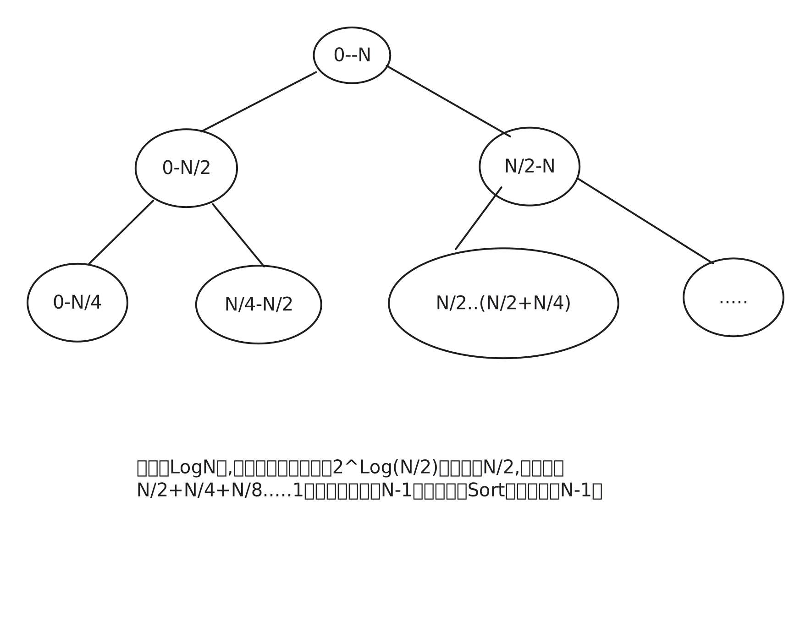

# 归并排序

归并排序是利用已有排序信息的一种方式，可以想象两个有序队列实现合并，先从A,B队列中各选取一个，选取其中较小的放入合并队列C中并从其相应队列中移除后依次取下个元素，再进行比较。直到所有元素都被合并完成


归并排序是一种分而治之的思想，它是不稳定的，其复杂度为NlogN


<pre class="language-java"><code class="lang-java"><strong>void sort(int[] arr,int lo,int hi) {
</strong>  if(hi&#x3C;=lo){
    return;
  }
  int mid=(hi-lo)/2+lo;
  sort(arr,lo,mid);
  sort(arr,mid+1,hi);
  merge(arr,lo,hi,mid);
}
void merge(int [] arr,int lo,int hi,int mid){
  int[] merged=new int[arr.length];
  int len=hi-lo+1;
  int i=l0;
  int j=mid+1;
  int index=i;
  while(len>0){
     if(i>mid){//左队列取完，取右队列
      merged[index++]=arr[j++];
     }else if(j>hi){//右队列取完，取左队列
      merged[index++]=arr[i++];
     }else if(arr[i]&#x3C;arr[j]){
      merged[index++]=arr[i++];
     }else{
      merged[index++]=arr[j++];
     }
     len--;
  }
  for(int i=lo;i&#x3C;=hi;i++){
   arr[i]=merged[i];//回写回去
  }
}
</code></pre>

若有N个元素，可以分解成若干个`sort` 的子问题，我们可以看到Sort方法执行了N-1次,

则Merge函数执行次数也为N-1次，而其中每层内循环方法总计执行次数为N，总计有logN层

$$
f(N) = N*logN+2*(N-1)
$$
